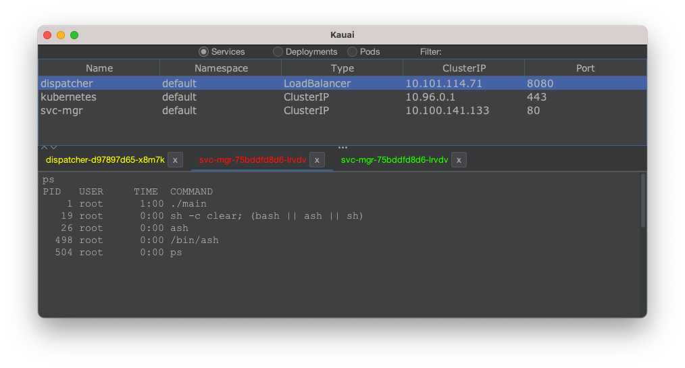

# Kauai

Kauak (pronounced "ka-wai") is a simple Kubernetes graphical explorer, with the following feature:

- Allows to look at deployments, services and pods
- Allows to perform a "describe", look at a pod's log and launch a remote shell to a pod

## Requirements

- macOS / Linux (not tested on Windows)
- Java runtime installed
- `kubectl` installed and configured

## Usage

- Select the desired resource type
- Filter by typing on the keyboard
- Right-click on the desired resource to see what actions can be done
- Alternatively, use the keyboard shortcut to launch the action (ctrl-d, ctrl-l or ctrl-s)
  - Keyboard shortcuts only work when the focus is on the table
  - Shift, Alt and Alt-Gr work as well as Ctrl for the shortcuts
- When opening a shell, the tab is at first empty. Don't let this fool you, you can type in commands (the prompt is not added yet)
